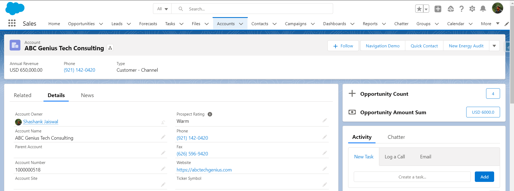

# Display Opportunity Details

### Problem Statement
Create a custom component using LWC to display the count and aggregate of Amount of all the opportunities belonging to an Account. The component should be available and display data on Lightning Record Page of Account object.

### Solution

### Considerations
This is a polished version of initial works and may or may not recieve updates in future.

 1. Considerations undertaken for Multi-Currency enabled Orgs.
 2. Return type on Apex Controller is a comma delimited string, however this can be changed to return a primitive or non-primitive type instead.
 3. JS Controller works by breaking down the comma delimited string into String[] and values are then mapped to each property individually.
 

#### Footnote
This can be optimized inline with the 2nd and 3rd point mentioned in **Considerations** but it's past 4 AM and I really don't want to right now. I should sleep.